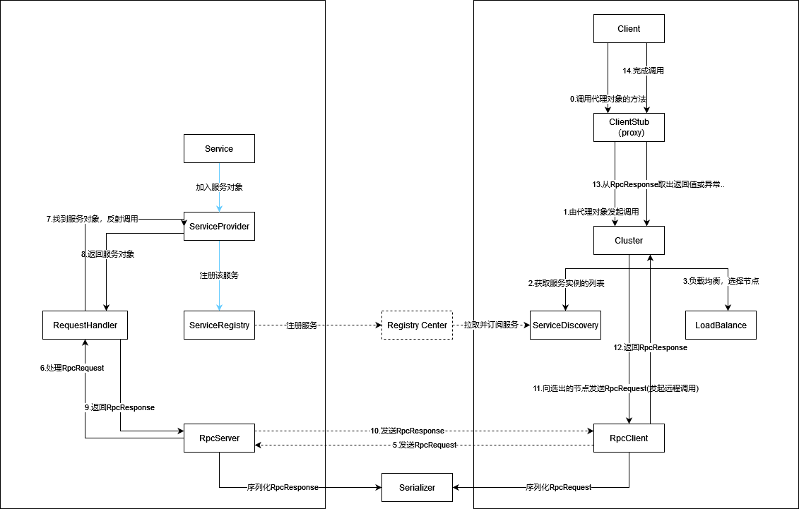

### 当前实现:
* 序列化:
  * JDK序列化(所有的返回值、参数必须是Serializable)
  * Hessian序列化(所有的返回值、参数必须是Serializable)
* 传输: 
  * 2种传输方式实现: 
    * BIO:
      * 一个连接只处理一个请求。
      * 消费者: 每次调用建立TCP连接，传输请求。
      * 提供者: 使用一个连接池。由一个线程accept，将接收到的连接，分配到一个线程进行处理。从连接种接收请求，进行调用，完成后返回响应并关闭连接。
    * Netty(NIO)
      * 消费者: 使用连接池复用连接(Channel)。一个连接处理多个请求。请求发出后，在与该request id关联的CompletableFuture上等待结果。
      * 消费者: 保持与消费者的连接。空闲时间超出设定值后，断开。
  * 传输协议:
    * 负载为 RpcRequest, RpcResponse按指定序列化方式序列化结果
    * RpcRequest 携带接口、方法、参数信息
    * RpcResponse 携带状态码、返回值
    * 传输的消息的格式:
    
   |       | 说明                |
   |-------|--------------------|
   | 0-3   | magic number       |
   | 4-7   | 整个消息的长度        |
   | 8-11  | Request Id 用于匹配一对请求响应|
   | 12-15 | 消息类型(0: 请求, 1: 响应)|
   | 16-20 | 序列化方式           |
   | 20... | 负载                |

  * 超时:
    * 客户端: 请求发出后，响应的超时(NettyRpcClient中实现, BIORpcClient未实现)
* 消费者一侧的桩对象:
  * JDK动态代理实现
* 服务注册与发现:
  * 面向接口的服务注册(一个接口为一个**服务**)
  * 使用Zookeeper作为注册中心
* 负载均衡
  * 随机
  * 轮询
  * 一致性hash
* 容错机制
  * Failfast 调用一次，若失败直接抛出异常
  * Failover 若调用失败，尝试其他服务提供者
  * FailSafe 失败时不抛出异常，返回空对象
  * Available 不进行负载均衡，遍历整个列表，直到调用成功

#### 整体流程  

#### 包结构
* github.qiao712.rpc
  * handler RequestHandler接口及其实现，处理请求调用目标方法
  * proto 定义通信协议
  * proxy 消费者一侧的代理相关
  * cluster 抽象一个集群，提供容错功能，整合服务发现、负载均衡、发起远程调用
  * loadbalance 负载均衡策略
  * registry 服务注册与发现
  * serializer 序列化方式
  * transport 各种实现的客户端(消费者发起请求)和服务器(提供者接收处理请求)
    * bio BIO实现
      * client
      * server
    * netty Netty实现
      * client
      * server
  * exception
  * util
  
### TODO:
* 配置
* 优雅停机
* 服务提供者下线时，Zookeeper的临时节点删除延时较大; 无法删除服务节点
* 心跳
* 整合Spring
* 实现Spring-starter支持自动配置
* 容错机制: Failback, Forking, Broadcast 
* 处理请求的线程池
* 各种组件的配置